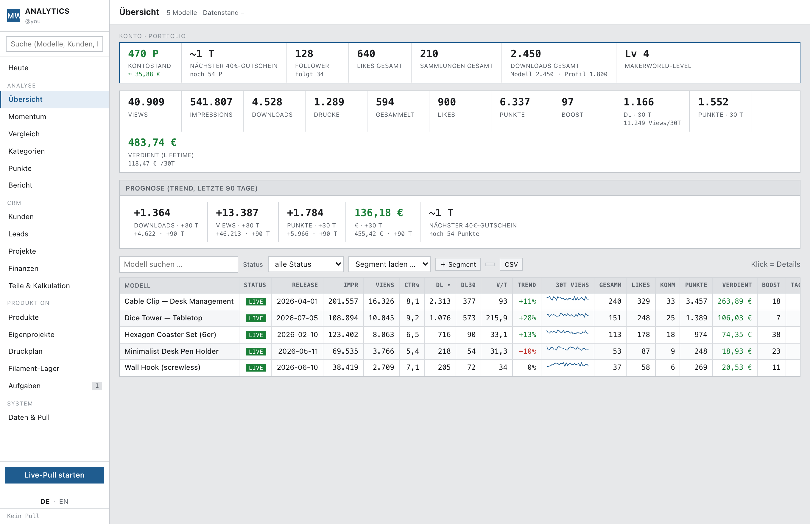
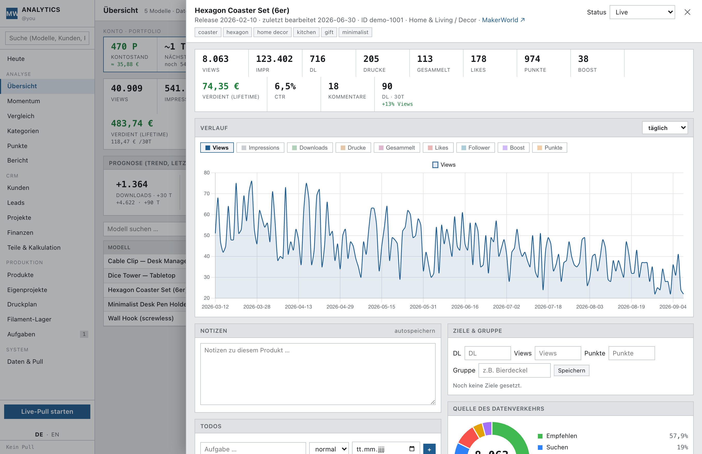
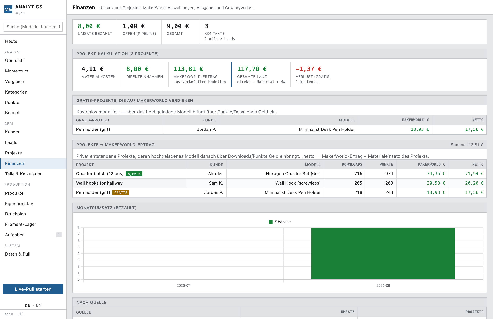
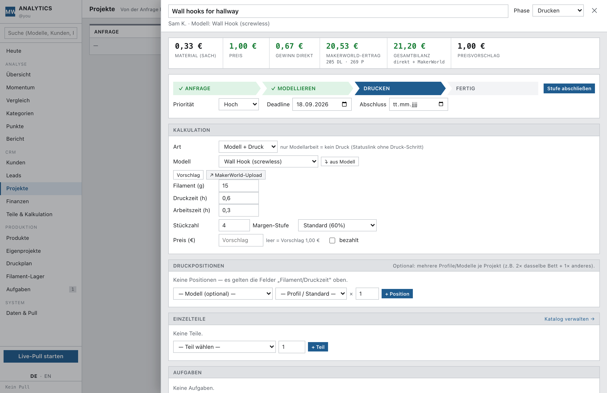
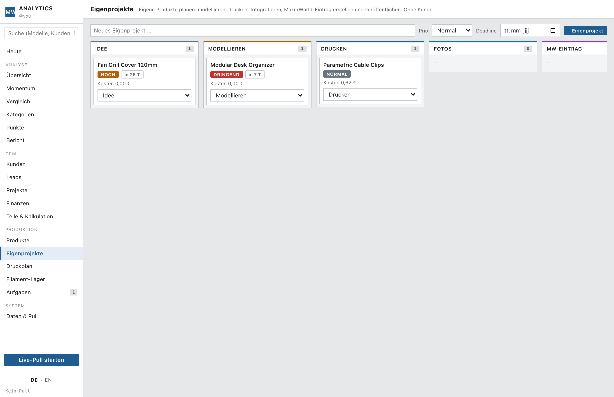
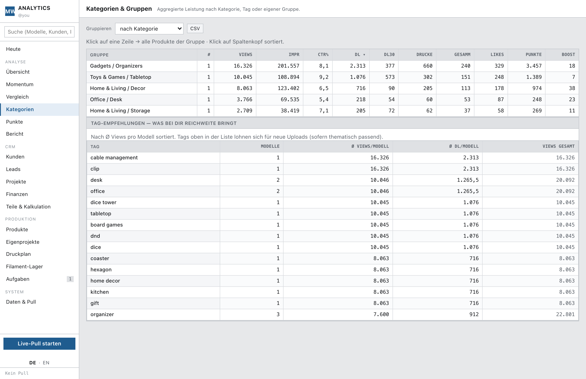

# MakerWorld Analytics

A self-hosted **analytics dashboard and lightweight CRM** for your own
[MakerWorld](https://makerworld.com) 3D models. It logs in with **your** account,
pulls the internal Creator-Center analytics (impressions, views, downloads,
prints, points/credits, boost) **plus** descriptions, tags, images, print
profiles and account/portfolio stats, stores everything in a local SQLite
database, and shows it as dashboards, per-model detail pages, trends, and a
small CRM for the models you print or design for other people.

No cloud, no accounts, no tracking — it runs on your machine (or a Raspberry Pi)
and the data never leaves it.

> **Bilingual UI (German / English).** The interface ships in German with a
> one-click **DE / EN** switch in the sidebar (and under *Daten & Pull*). Code and
> this README are English.



*All screenshots use the built-in **demo data** (`npm run seed:demo`) — not a real account.*

---

## Features

**Analytics**
- Portfolio KPIs: points/credits, next voucher threshold, followers, likes,
  collections, downloads, MakerWorld level.
- Per-model table with CTR, 30-day downloads, trend arrows and view sparklines;
  searchable, sortable, savable as segments, CSV export.
- Model detail: full lifetime metrics, a multi-metric history chart (any metric,
  daily or cumulative), traffic sources (recommend/search/browse/direct) as a
  donut, a conversion funnel, image gallery, tags, and per-print-profile stats
  (filament weight, print time, ratings).
- **Change timeline & CTR impact:** edits to cover image, title, tags or
  description are detected automatically on each pull, and the app measures CTR
  and impressions before/after the change (±21 days).
- Momentum, model comparison (aligned by date **or** by age since release),
  category breakdown, points economy, and a trend-based forecast.

**CRM (for prints/commissions you do for friends & customers)**
- Contacts and a lead pipeline (kanban).
- Projects with a **live 3D-print cost calculator**: filament (g × €/kg) +
  parts + energy = material; + labour = your cost; price = cost × margin,
  rounded, with configurable margin tiers (e.g. Standard / Friends / Free).
- **Multiple print positions per project:** pick several models/print profiles
  each with their own quantity — for when one print bed only fits part of an
  order (e.g. 2× one profile + 1× another). Filament and print time are summed
  automatically, and can be pulled straight from the linked model's profile.
- Parts catalog (magnets, screws, inserts …) with unit prices that flow into
  the calculation.
- **"Did this project pay off?"** — because a model you made privately for a
  friend can later earn credits on MakerWorld, the Finances page links projects
  to their uploaded model and shows the resulting downloads/points/€ next to the
  project's material cost.
- **Priorities & deadlines** on every project (low → urgent, with overdue
  badges) and a **stage "path" bar** (à la Salesforce) with one-click *complete
  stage* and an auto-filled close date.
- **Kanban boards with drag & drop** (leads, projects, own projects, products) —
  drag a card to another column, or use the dropdown.
- **Model-only jobs** (you model, the friend prints): the calculator hides the
  print side, and the customer status page skips the print step.
- Invoice / receipt as a clean printable page → **Save as PDF** and send it
  yourself via WhatsApp / e-mail / AirDrop (nothing is sent automatically).
- P&L (income vs. expenses vs. point payouts), expense and payout tracking,
  global search, a "Today" action dashboard, and an optional daily digest push.

**Production & planning**
- **Own projects** (no customer): plan your own products through *idea → model →
  print → photos → MakerWorld entry → published*, with priority and deadline.
- **Print queue** — every open print position across all projects in one place:
  what to print next, total filament & time, mark prints done.
- **Filament stock** — spools with remaining grams; a print deducts automatically;
  low-stock warnings.
- **Shareable status link** — a read-only order-status page for a customer
  (progress, positions, price, paid badge). Served by a separate, isolated
  process so only that page is exposed; the dashboard stays local. For
  model-only jobs you can attach the **`.3mf` file**, downloadable once the order
  is marked paid.

**Reverse-engineering the points system**
- A **Points Matrix** estimates points per download / per print from your daily
  history, shows where points come from (model / profile / ratings), the timing
  between point events per model, and a 30-day forecast — it gets more accurate
  with every pull.
- Aggregated **change-impact** across all models (does changing the cover / title
  / tags actually raise CTR?), a weekly insights report and milestone push
  notifications (1000 downloads, next voucher, models going cold).

**Data**
- One live pull button, plus an optional scheduled daily pull (cron).
- Everything is stored raw as well, so new fields can be re-derived later.

| Model detail | Finances | Project calculator |
|---|---|---|
|  |  |  |

| Own projects (planning) | Categories |
|---|---|
|  |  |

---

## Quick start

```bash
git clone https://github.com/Hicksonaut/makerworld-analytics.git
cd makerworld-analytics
npm install
npx playwright install chromium     # browser used for the authenticated pull
```

**Try it with demo data first** (no login needed):

```bash
npm run seed:demo
npm start
# open http://localhost:4000
```

**Use it with your own MakerWorld account:**

```bash
npm start                 # then in the app: Daten & Pull → open the login window
```

1. **Log in once.** A real Chromium window opens — sign in to MakerWorld. The
   session is stored in `data/browser-profile/` (only needed once). A real
   browser is used because MakerWorld sits behind Cloudflare and supports
   passkeys.
2. **Pull.** Hit *Live-Pull starten*. It collects every model: analytics time
   series, description, tags, images, print profiles and your account stats.
3. Optionally enable the **daily automatic pull**.

> To reset the demo and start clean, delete `data/makerworld.db*` (or the whole
> `data/` folder) and pull.

---

## Running on a Raspberry Pi (optional)

It runs unattended on a Pi (tested on aarch64 / Node 20). Because headless
Chromium is blocked by Cloudflare, the pull runs a *headful* browser on a
virtual display via `xvfb`:

```bash
sudo apt install xvfb
```

A ready-made systemd unit is in [`deploy/makerworld-analytics.service`](deploy/makerworld-analytics.service)
(edit the user/paths, then `systemctl enable --now`). Chrome per-machine cookie
encryption means you can't just copy the browser profile across machines —
export the decrypted session on your desktop and drop it on the Pi:

```bash
node server/scraper.js --export-session   # writes data/session.json
# copy data/session.json to the Pi; the pull injects it automatically
```

---

## Tech

Node.js (ESM) · Express · better-sqlite3 · Playwright (real Chrome) · node-cron.
Vanilla-JS single-page frontend with Chart.js — **no build step**. Data lives in
one SQLite file under `data/` (git-ignored).

```
server/   db.js  index.js  public.js  publicPage.js  scraper.js  ingest.js
          crm.js  importer.js  seed-demo.js
web/      index.html  app.js  styles.css  vendor/chart.umd.min.js
deploy/   makerworld-analytics.service  makerworld-public.service
```

The optional **public status page** runs as a second, minimal process
(`server/public.js`, [`deploy/makerworld-public.service`](deploy/makerworld-public.service))
that only serves `/p/:token` — expose *just that* to the internet (e.g. a
Tailscale Funnel to `127.0.0.1:4001`) while the dashboard stays on your LAN.

---

## Disclaimer

This is a personal, **unofficial** tool. It is not affiliated with, endorsed by,
or connected to MakerWorld or Bambu Lab. It only reads data from **your own**
logged-in account for your own use. You are responsible for complying with
MakerWorld's Terms of Service. Provided as-is, no warranty (MIT).
